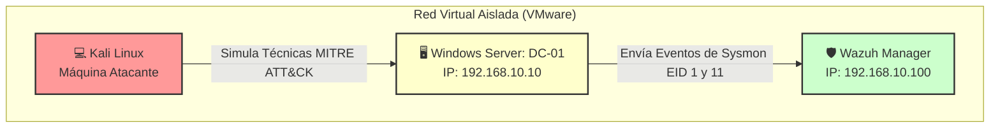

# 🛡️ Proyecto SOC Lab: Detección y Threat Hunting Avanzado con Wazuh y Sysmon

¡Bienvenido a mi proyecto de laboratorio de SOC! En este repositorio detallo el proceso de diseño, implementación y simulación de ataques en un entorno controlado. El objetivo principal ha sido desplegar un sistema de monitorización centralizado utilizando **Wazuh (SIEM/XDR)** y **Sysmon** para cazar técnicas de ataque reales sobre un entorno de **Windows Server (Active Directory)**.

Además de los pasos de instalación, he documentado con total transparencia los **problemas técnicos de la vida real** que surgieron durante el despliegue y cómo los solucioné, sirviendo de guía para mí mismo y para otros analistas que estén empezando.

---

## 🗺️ 1. Arquitectura del Laboratorio

El laboratorio está compuesto por tres máquinas virtuales corriendo en un entorno aislado dentro de VMware Workstation:

*   **Wazuh Manager / SIEM:** Servidor central encargado de recibir, correlacionar y alertar sobre los logs de seguridad.
*   **DC-01 (Windows Server - Active Directory):** Servidor objetivo (Target) donde se simula la actividad del administrador y los ataques. Tiene instalado el Agente de Wazuh y Microsoft Sysmon.
*   **Kali Linux:** Máquina del atacante utilizada para realizar fases de reconocimiento y explotación de vulnerabilidades.


---

## 🚀 2. Implementación Paso a Paso

### Paso A: Despliegue del Agente de Wazuh
Se instaló el agente de Wazuh en el controlador de dominio de Windows Server para iniciar el envío básico de logs de seguridad del sistema.

### Paso B: Instalación y Configuración de Sysmon
Para mejorar la visibilidad de los comandos ejecutados (que por defecto Windows no muestra de forma detallada), instalé **Sysmon** con una configuración básica sin filtros de exclusión para registrar toda la actividad en este laboratorio.

1. Se creó el archivo de configuración `config.xml`:
```powershell
$config = @"
<Sysmon schemaversion="4.50">
  <EventFiltering>
    <ProcessCreate onmatch="exclude"/>
    <NetworkConnect onmatch="exclude"/>
  </EventFiltering>
</Sysmon>
"@
Out-File -FilePath .\config.xml -InputObject $config -Encoding ascii
