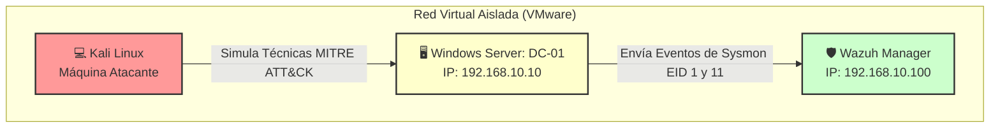
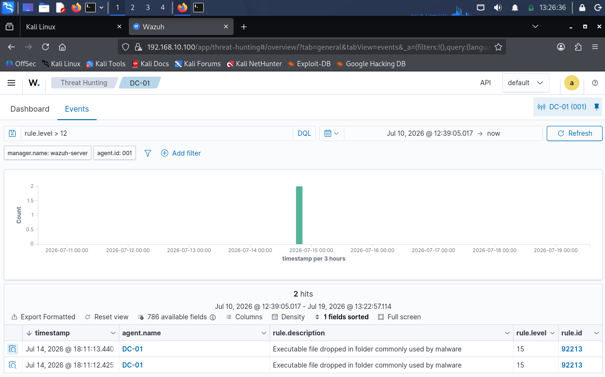
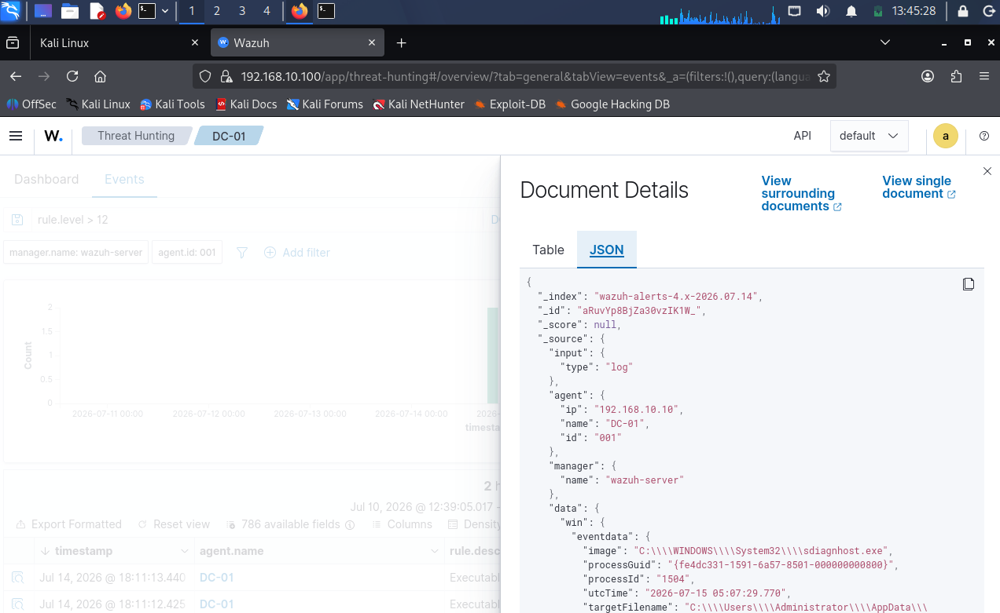

# 🛡️ Proyecto SOC Lab: Detección y Threat Hunting Avanzado con Wazuh y Sysmon

¡Bienvenido a mi proyecto de laboratorio de SOC! En este repositorio detallo el proceso de diseño, implementación y simulación de ataques en un entorno controlado. El objetivo principal ha sido desplegar un sistema de monitorización centralizado utilizando **Wazuh (SIEM/XDR)** y **Sysmon** para cazar técnicas de ataque reales sobre un entorno de **Windows Server (Active Directory)**.

Además de los pasos de instalación, he documentado con total transparencia los **problemas técnicos de la vida real** que surgieron durante el despliegue y cómo los solucioné, sirviendo de guía para mí mismo y para otros analistas que estén empezando.

---

## 🗺️ 1. Arquitectura del Laboratorio

El laboratorio está compuesto por tres máquinas virtuales corriendo en un entorno aislado dentro de VMware Workstation:

*   **Wazuh Manager / SIEM:** Servidor central encargado de recibir, correlacionar y alertar sobre los logs de seguridad.
*   **DC-01 (Windows Server - Active Directory):** Servidor objetivo (Target) donde se simula la actividad del administrador y los ataques. Tiene instalado el Agente de Wazuh y Microsoft Sysmon.
*   **Kali Linux:** Máquina del atacante utilizada para realizar fases de reconocimiento y explotación de vulnerabilidades.


---

## 🚀 2. Implementación Paso a Paso

### Paso A: Despliegue del Agente de Wazuh
Se instaló el agente de Wazuh en el controlador de dominio de Windows Server para iniciar el envío básico de logs de seguridad del sistema.

### Paso B: Instalación y Configuración de Sysmon
Para mejorar la visibilidad de los comandos ejecutados (que por defecto Windows no muestra de forma detallada), instalé **Sysmon** con una configuración básica sin filtros de exclusión para registrar toda la actividad en este laboratorio.

1. Se creó el archivo de configuración `config.xml`:
```powershell
$config = @"
<Sysmon schemaversion="4.50">
  <EventFiltering>
    <ProcessCreate onmatch="exclude"/>
    <NetworkConnect onmatch="exclude"/>
  </EventFiltering>
</Sysmon>
"@
Out-File -FilePath .\config.xml -InputObject $config -Encoding ascii
```

## Paso C: Integración de Sysmon con Wazuh

Para indicar al agente de Wazuh que lea el canal de eventos de Sysmon, se editó el archivo de configuración del agente ubicado en:

```text
C:\Program Files (x86)\ossec-agent\ossec.conf
```

Antes de la etiqueta de cierre `</ossec_config>` se añadió el siguiente bloque:

```xml
<localfile>
  <location>Microsoft-Windows-Sysmon/Operational</location>
  <log_format>eventchannel</log_format>
</localfile>
```

Una vez guardados los cambios, se reinició el servicio del agente de Wazuh desde PowerShell para aplicar la nueva configuración:

```powershell
Restart-Service -Name Wazuh
```

---

# 🎯 3. Simulaciones de Ataque y Detección

## Caso de Uso 1: Fase de Reconocimiento (`whoami /priv`)

### Objetivo del atacante

Tras comprometer una cuenta, el atacante ejecuta un comando de enumeración de privilegios para comprobar si dispone de permisos críticos, como **SeDebugPrivilege**, que podrían facilitar una escalada de privilegios.

### Comando ejecutado

```powershell
whoami /priv
```

### Detección en Wazuh

Wazuh registró correctamente la ejecución del comando, generando una alerta correspondiente al inicio del proceso. Este evento permitió comprobar cómo el SIEM correlaciona la creación de procesos iniciados desde la consola de comandos.



---

## Caso de Uso 2: Enumeración del grupo de Administradores Locales

### Objetivo del atacante

Identificar qué usuarios pertenecen al grupo de administradores locales para planificar un posible movimiento lateral o una escalada de privilegios.

### Comando ejecutado

```powershell
cmd.exe /c "net localgroup administrators"
```

### Detección mediante Sysmon (Event ID 1)

Sysmon registró el evento de creación del proceso proporcionando información forense mucho más detallada que los registros nativos de Windows.

**Información registrada:**

- **Proceso creado (Image):**

```text
C:\Windows\System32\net.exe
```

- **Proceso padre (ParentImage):**

```text
C:\Windows\System32\cmd.exe
```

- **Línea de comandos (CommandLine):**

```text
net localgroup administrators
```

Esta información permite reconstruir la cadena padre-hijo de procesos, facilitando el análisis durante una investigación forense.

---

# 🧠 4. Lecciones Aprendidas y Troubleshooting

Durante el desarrollo del laboratorio surgieron varios problemas habituales en entornos SOC reales. Resolverlos permitió comprender mejor el funcionamiento de Wazuh y Sysmon.

---

## Reto 1: Alertas invisibles (Clock Drift)

### Problema

Tras ejecutar comandos en Windows Server, las alertas no aparecían inmediatamente en el panel **Live** de Wazuh.

### Causa

Las máquinas virtuales presentaban un desfase horario (**Clock Drift**). El reloj de Windows Server estaba retrasado respecto al de Kali Linux.

Como el Dashboard de Wazuh muestra por defecto únicamente los eventos de los últimos 15 minutos, los registros generados en Windows quedaban fuera del rango temporal y no eran visibles.

### Solución

- Cambiar el filtro temporal del Dashboard a **Last 7 days**.
- Activar la sincronización automática del reloj en las máquinas virtuales.

---

## Reto 2: Búsquedas sin resultados (Dashboard Query Language)

### Problema

Al buscar simplemente:

```text
net.exe
```

no se obtenían resultados.

### Causa

El motor de búsqueda **Dashboard Query Language (DQL)** realiza coincidencias exactas cuando se introduce texto plano.

Como Sysmon almacenaba la ruta completa del ejecutable:

```text
C:\Windows\System32\net.exe
```

la búsqueda no coincidía.

### Solución

Realizar búsquedas utilizando comodines o directamente sobre campos específicos.

Ejemplo:

```text
win.eventdata.image:*net.exe*
```

De esta forma Wazuh localiza correctamente todos los procesos cuyo ejecutable termina en **net.exe**.

---

## Reto 3: Análisis de falsos positivos (Event ID 11)

### Problema

Se generó una alerta de gravedad **15 (Critical)** con la descripción:

```text
Executable file dropped in folder commonly used by malware
```

### Investigación

Al revisar el JSON completo de la alerta se observó que:

- **Event ID:** 11 (Creación de archivo)
- **Proceso responsable:** `sdiagnhost.exe`

El proceso pertenecía al propio sistema operativo Windows y estaba escribiendo un archivo temporal dentro de la carpeta **Temp**.

### Conclusión

Se determinó que el evento correspondía a un comportamiento legítimo del sistema operativo.

Los servicios internos de Windows utilizan frecuentemente directorios temporales para almacenar archivos durante tareas de diagnóstico.

En consecuencia, la alerta fue clasificada como un **falso positivo**, evitando así generar fatiga de alertas dentro del SOC.



---

# 🛠️ Herramientas Utilizadas

| Herramienta | Descripción |
|------------|-------------|
| **SIEM/XDR** | Wazuh Manager v4.x |
| **Telemetría del host** | Microsoft Sysmon v15.x |
| **Sistema Operativo** | Windows Server 2022 |
| **Sistema de Monitorización** | Kali Linux |
| **Infraestructura** | Active Directory Lab |

---

## Conclusiones

La integración de Sysmon con Wazuh permitió ampliar significativamente la visibilidad sobre la actividad del sistema Windows. Mientras que los registros nativos ofrecen información básica, Sysmon proporciona datos detallados sobre la creación de procesos, relaciones padre-hijo y líneas de comandos completas, facilitando la detección de técnicas utilizadas durante las fases de reconocimiento y enumeración.

Asimismo, el laboratorio puso de manifiesto la importancia de aspectos operativos como la sincronización horaria, el uso correcto del lenguaje de consultas de Wazuh y el análisis de falsos positivos, competencias esenciales para un analista de un Centro de Operaciones de Seguridad (SOC).

Virtualización: VMware Workstation.
