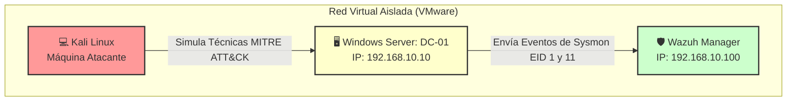
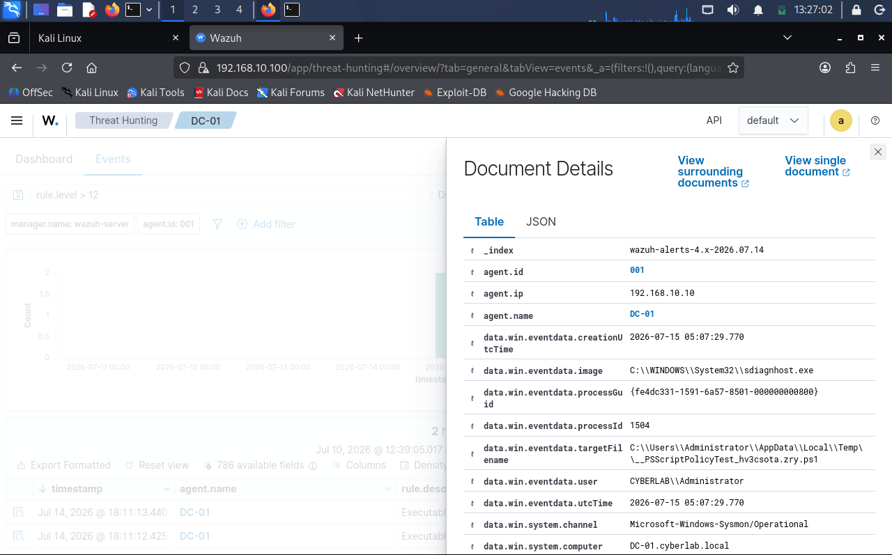
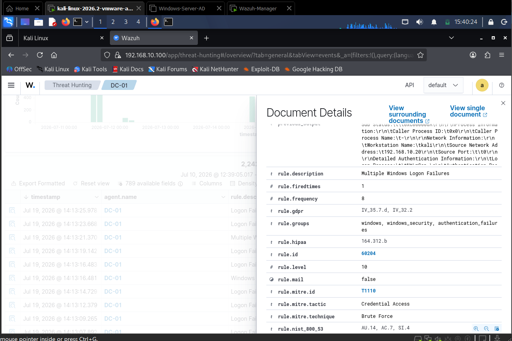
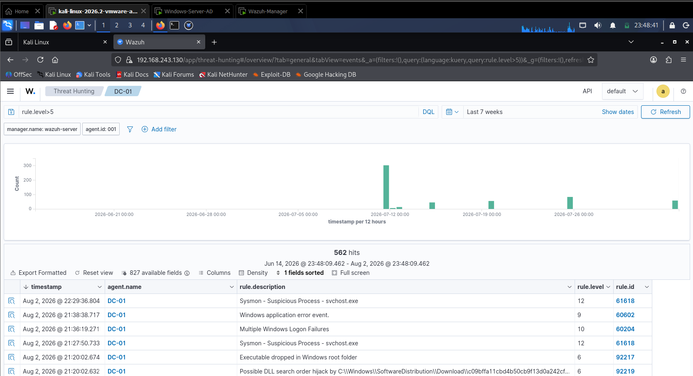
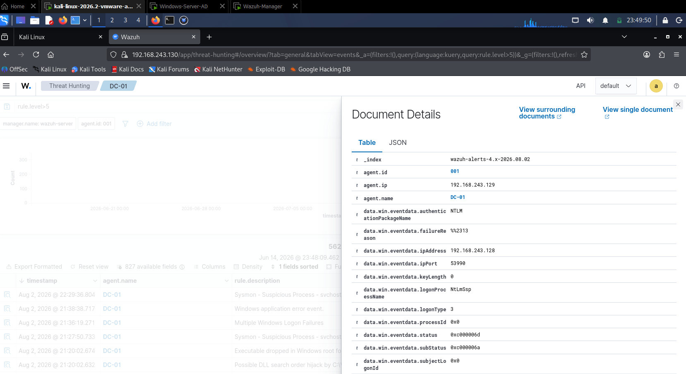
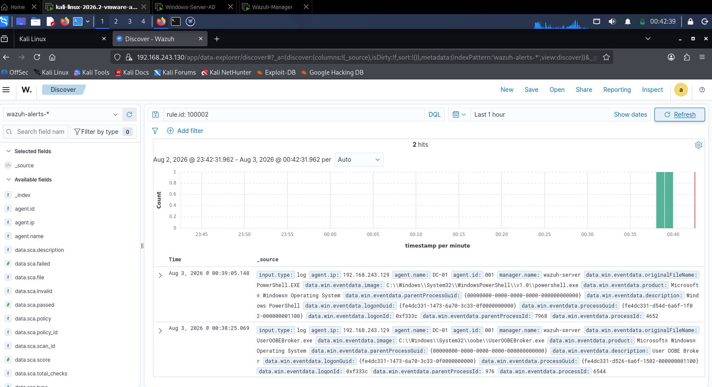

# 🛡️ Proyecto SOC Lab: Detección y Threat Hunting Avanzado con Wazuh y Sysmon

¡Bienvenido a mi proyecto de laboratorio de SOC! En este repositorio detallo el proceso de diseño, implementación y simulación de ataques en un entorno controlado. El objetivo principal ha sido desplegar un sistema de monitorización centralizado utilizando **Wazuh (SIEM/XDR)** y **Sysmon** para cazar técnicas de ataque reales sobre un entorno de **Windows Server (Active Directory)**.

Además de los pasos de instalación, he documentado con total transparencia los **problemas técnicos de la vida real** que surgieron durante el despliegue y cómo los solucioné, sirviendo de guía para mí mismo y para otros analistas que estén empezando.

---

## 🗺️ 1. Arquitectura del Laboratorio

El laboratorio está compuesto por tres máquinas virtuales corriendo en un entorno aislado dentro de VMware Workstation:

*   **Wazuh Manager / SIEM:** Servidor central encargado de recibir, correlacionar y alertar sobre los logs de seguridad.
*   **DC-01 (Windows Server - Active Directory):** Servidor objetivo (Target) donde se simula la actividad del administrador y los ataques. Tiene instalado el Agente de Wazuh y Microsoft Sysmon.
*   **Kali Linux:** Máquina del atacante utilizada para realizar fases de reconocimiento y explotación de vulnerabilidades.


---

## 🚀 2. Implementación Paso a Paso

### Paso A: Despliegue del Agente de Wazuh
Se instaló el agente de Wazuh en el controlador de dominio de Windows Server para iniciar el envío básico de logs de seguridad del sistema.

### Paso B: Instalación y Configuración de Sysmon
Para mejorar la visibilidad de los comandos ejecutados (que por defecto Windows no muestra de forma detallada), instalé **Sysmon** con una configuración básica sin filtros de exclusión para registrar toda la actividad en este laboratorio.

1. Se creó el archivo de configuración `config.xml`:
```powershell
$config = @"
<Sysmon schemaversion="4.50">
  <EventFiltering>
    <ProcessCreate onmatch="exclude"/>
    <NetworkConnect onmatch="exclude"/>
  </EventFiltering>
</Sysmon>
"@
Out-File -FilePath .\config.xml -InputObject $config -Encoding ascii
```

## Paso C: Integración de Sysmon con Wazuh

Para indicar al agente de Wazuh que lea el canal de eventos de Sysmon, se editó el archivo de configuración del agente ubicado en:

```text
C:\Program Files (x86)\ossec-agent\ossec.conf
```

Antes de la etiqueta de cierre `</ossec_config>` se añadió el siguiente bloque:

```xml
<localfile>
  <location>Microsoft-Windows-Sysmon/Operational</location>
  <log_format>eventchannel</log_format>
</localfile>
```

Una vez guardados los cambios, se reinició el servicio del agente de Wazuh desde PowerShell para aplicar la nueva configuración:

```powershell
Restart-Service -Name Wazuh
```

---

# 🎯 3. Simulaciones de Ataque y Detección

## Caso de Uso 1: Fase de Reconocimiento (`whoami /priv`)

### Objetivo del atacante

Tras comprometer una cuenta, el atacante ejecuta un comando de enumeración de privilegios para comprobar si dispone de permisos críticos, como **SeDebugPrivilege**, que podrían facilitar una escalada de privilegios.

### Comando ejecutado

```powershell
whoami /priv
```

### Detección en Wazuh

Wazuh registró correctamente la ejecución del comando, generando una alerta correspondiente al inicio del proceso. Este evento permitió comprobar cómo el SIEM correlaciona la creación de procesos iniciados desde la consola de comandos.


---

## Caso de Uso 2: Enumeración del grupo de Administradores Locales

### Objetivo del atacante

Identificar qué usuarios pertenecen al grupo de administradores locales para planificar un posible movimiento lateral o una escalada de privilegios.

### Comando ejecutado

```powershell
cmd.exe /c "net localgroup administrators"
```

### Detección mediante Sysmon (Event ID 1)

Sysmon registró el evento de creación del proceso proporcionando información forense mucho más detallada que los registros nativos de Windows.

**Información registrada:**

- **Proceso creado (Image):**

```text
C:\Windows\System32\net.exe
```

- **Proceso padre (ParentImage):**

```text
C:\Windows\System32\cmd.exe
```

- **Línea de comandos (CommandLine):**

```text
net localgroup administrators
```

Esta información permite reconstruir la cadena padre-hijo de procesos, facilitando el análisis durante una investigación forense.



---
---

## Caso de Uso 3: Ataque de Fuerza Bruta por RDP

### Objetivo del atacante

Obtener acceso inicial al Controlador de Dominio mediante un ataque de fuerza bruta por diccionario contra el servicio de **Remote Desktop Protocol (RDP)**, dirigido a la cuenta con mayores privilegios del sistema (**Administrator**).

### Comando ejecutado (Kali Linux)

Se utilizó la herramienta **Hydra** junto con un diccionario personalizado de contraseñas para generar múltiples intentos de autenticación fallidos contra el puerto **3389**.

```bash
hydra -l administrator -P contras_fuerza_bruta.txt rdp://192.168.10.10 -vV -t 1
```

---

### Detección en Wazuh

Wazuh recopiló correctamente los eventos de seguridad generados por Windows correspondientes al **Event ID 4625 (Failed Logon)**.

Tras detectar numerosos intentos de autenticación fallidos en un intervalo reducido de tiempo, el motor de correlación agrupó los eventos individuales y generó una alerta de mayor severidad, identificando el patrón como un posible ataque de fuerza bruta.

---

### Evidencias detectadas

- **Evento de Windows:** Event ID **4625** (Failed Logon).
- **Regla de Wazuh:** `rule.id: 60122`.
- **Nivel inicial de alerta:** **5**.
- **Alerta correlacionada:** **Nivel 10 (Critical Alert)**.

---

### Información forense obtenida

La alerta proporciona información relevante para el análisis del incidente, entre la que destaca:

- **Mapeo MITRE ATT&CK**
  - **Táctica:** Credential Access
  - **Técnica:** T1110 – Brute Force

- **Origen del ataque**
  - **Workstation Name:** `kali`
  - **Source Network Address:** Dirección IP del equipo atacante.

- **Cumplimiento normativo**
  - Asociación automática con controles de:
    - NIST 800-53
    - GDPR
    - HIPAA

---
### Evidencia de la alerta



**Figura:** Alerta correlacionada de Wazuh detectando un ataque de fuerza bruta contra el servicio RDP.

---
---
## Caso de Uso 4: Ataque de Fuerza Bruta por SMB (Puerto 445) y Análisis NTLM

Objetivo del atacante
Simular una ráfaga masiva de intentos de inicio de sesión (*Password Spraying / Fuerza Bruta*) contra el servicio de compartición de archivos SMB (`445/TCP`) en el Controlador de Dominio (`DC-01`) desde Kali Linux.

Comando ejecutado (Kali Linux)
Debido a la restricción de negociación de dialectos antiguos en Windows Server 2022, se utilizó un bucle automatizado enviando solicitudes directas mediante `smbclient`:

```bash
for i in {1..10}; do smbclient //192.168.243.129/C$ -U "Administrator\%WrongPass$i"; done
```

Detección y Correlación en Wazuh
El agente de Wazuh en Windows Server registró los eventos individuales de fallo de autenticación (Event ID 4625). Al acumularse múltiples intentos en un intervalo reducido de segundos, el motor de Wazuh escaló la alerta a nivel crítico.

Evidencias e Indicadores de Compromiso (IoCs):

Regla Individual: rule.id: 60122 (Nivel 5) – Logon Failure - Unknown user or bad password.

Regla Correlacionada: rule.id: 60204 (Nivel 10 - Severidad Alta 🔴) – Multiple Windows Logon Failures.

Paquete de Autenticación: NTLM / NTLMSSP.

Tipo de Logon: 3 (Network Logon).

IP Origen Atacante: 192.168.243.128 (Kali Linux).


*Figura: Escalado automático en Wazuh a una Alerta Crítica de Nivel 10 tras detectar la ráfaga de intentos fallidos.*

---


*Figura: Detalle forense del evento en Wazuh mostrando la IP atacante y el paquete de autenticación NTLM.*

---
---
## Caso de Uso 5: Detección de Tráfico y Firmas de Red con Suricata NIDS

Objetivo del atacante
Identificar actividad anómala a nivel de interfaz de red (escaneo de puertos / firmas IDS) antes de que alcance las capas internas del sistema operativo.

Configuración e Integración
Suricata inspecciona el tráfico de red y escribe los eventos en `/var/log/suricata/eve.json`. Wazuh procesa este archivo en tiempo real mediante la integración JSON en `ossec.conf`:

```xml
<localfile>
  <log_format>json</log_format>
  <location>/var/log/suricata/eve.json</location>
</localfile>
```
---
---

## Caso de Uso 6: Ingeniería de Detección – Regla Personalizada para Evasión en PowerShell (Rule ID 100002)

#### 🎯 Objetivo del Atacante
Ejecutar comandos en PowerShell utilizando argumentos codificados en Base64 (`-e` / `-EncodedCommand`) para intentar evadir controles de seguridad tradicionales y filtros de firmas de texto plano (Técnica MITRE ATT&CK: **T1059.001**).

#### 🛠️ Regla Personalizada Implementada (`local_rules.xml`)
Se configuró una regla custom de **Nivel 12 (Crítico)** que inspecciona la línea de comandos emitida por los eventos de creación de procesos de Sysmon (`if_sid: 61603` / Event ID 1):

```xml
<rule id="100002" level="12">
  <if_sid>61603</if_sid>
  <field name="win.eventdata.commandLine" type="pcre2">(?i)-e(ncodedcommand)?</field>
  <description>SOC Lab: Se detectó ejecución sospechosa de PowerShell codificado en Base64 (-EncodedCommand)</description>
  <mitre>
    <id>T1059.001</id>
  </mitre>
</rule>
```

*Figura: Confirmación en Wazuh Discover de la regla personalizada 100002 disparada tras la ejecución de PowerShell codificado.*

---

# 🧠 4. Lecciones Aprendidas y Troubleshooting

Durante el desarrollo del laboratorio surgieron varios problemas habituales en entornos SOC reales. Resolverlos permitió comprender mejor el funcionamiento de Wazuh y Sysmon.
--

## Reto 1: Alertas invisibles (Clock Drift)

### Problema

Tras ejecutar comandos en Windows Server, las alertas no aparecían inmediatamente en el panel **Live** de Wazuh.

### Causa

Las máquinas virtuales presentaban un desfase horario (**Clock Drift**). El reloj de Windows Server estaba retrasado respecto al de Kali Linux.

Como el Dashboard de Wazuh muestra por defecto únicamente los eventos de los últimos 15 minutos, los registros generados en Windows quedaban fuera del rango temporal y no eran visibles.

### Solución

- Cambiar el filtro temporal del Dashboard a **Last 7 days**.
- Activar la sincronización automática del reloj en las máquinas virtuales.

---

## Reto 2: Búsquedas sin resultados (Dashboard Query Language)

### Problema

Al buscar simplemente:

```text
net.exe
```

no se obtenían resultados.

### Causa

El motor de búsqueda **Dashboard Query Language (DQL)** realiza coincidencias exactas cuando se introduce texto plano.

Como Sysmon almacenaba la ruta completa del ejecutable:

```text
C:\Windows\System32\net.exe
```

la búsqueda no coincidía.

### Solución

Realizar búsquedas utilizando comodines o directamente sobre campos específicos.

Ejemplo:

```text
win.eventdata.image:*net.exe*
```

De esta forma Wazuh localiza correctamente todos los procesos cuyo ejecutable termina en **net.exe**.

---

## Reto 3: Análisis de falsos positivos (Event ID 11)

### Problema

Se generó una alerta de gravedad **15 (Critical)** con la descripción:

```text
Executable file dropped in folder commonly used by malware
```

### Investigación

Al revisar el JSON completo de la alerta se observó que:

- **Event ID:** 11 (Creación de archivo)
- **Proceso responsable:** `sdiagnhost.exe`

El proceso pertenecía al propio sistema operativo Windows y estaba escribiendo un archivo temporal dentro de la carpeta **Temp**.

### Conclusión

Se determinó que el evento correspondía a un comportamiento legítimo del sistema operativo.

Los servicios internos de Windows utilizan frecuentemente directorios temporales para almacenar archivos durante tareas de diagnóstico.

En consecuencia, la alerta fue clasificada como un **falso positivo**, evitando así generar fatiga de alertas dentro del SOC.


---

## Reto 4: Bloqueo de Sincronización Horaria y Desfase de 6 Horas (Clock Drift)

### Problema
Las alertas generadas en Windows Server aparecían con 6 horas de retraso en el panel de Wazuh, impidiendo la visibilidad en tiempo real (*Live Dashboard*). La interfaz de Windows bloqueaba los cambios con el mensaje *"Some of these settings are managed by your organization"*.

### Causa
VMware Tools tenía activada la sincronización automática del "Guest" con el "Host", sobrescribiendo cualquier cambio de hora o zona horaria ejecutado en el sistema operativo.

### Solución
1. Desactivar la opción en VMware Workstation: **VM > Settings > Options > VMware Tools > Desmarcar "Synchronize guest time with host"**.
2. Forzar la zona horaria correcta de España y reiniciar el servicio de hora en PowerShell:

```powershell
Set-TimeZone -Id "Romance Standard Time"
net stop w32time ; net start w32time
```

### 🛠️ Herramientas Utilizadas

| Herramienta | Tipo / Categoría | Descripción / Función en el Lab |
| :--- | :--- | :--- |
| **Wazuh Manager v4.x** | SIEM / XDR | Centralización, correlación de logs y motor de alertas. |
| **Microsoft Sysmon v15.x** | HIDS / Endpoint Telemetry | Auditoría avanzada de procesos, líneas de comando (Event ID 1) y hashes. |
| **Suricata v7.x** | NIDS / Network Security | Inspección profunda de paquetes y detección de firmas de red (`eve.json`). |
| **Windows Server 2022** | Host Objetivo / Target | Controlador de Dominio (`DC-01`) monitoreado por el agente Wazuh + Sysmon. |
| **Kali Linux** | Atacante / Red Team | Generación de tráfico y ataques (`nmap`, `smbclient`, `hydra`, `powershell`). |
| **VMware Workstation** | Virtualización | Infraestructura aislada en red local virtualizada (`192.168.243.0/24`). |

---

## Conclusiones

La integración de Sysmon con Wazuh permitió ampliar significativamente la visibilidad sobre la actividad del sistema Windows. Mientras que los registros nativos ofrecen información básica, Sysmon proporciona datos detallados sobre la creación de procesos, relaciones padre-hijo y líneas de comandos completas, facilitando la detección de técnicas utilizadas durante las fases de reconocimiento y enumeración.

Asimismo, el laboratorio puso de manifiesto la importancia de aspectos operativos como la sincronización horaria, el uso correcto del lenguaje de consultas de Wazuh y el análisis de falsos positivos, competencias esenciales para un analista de un Centro de Operaciones de Seguridad (SOC).

Virtualización: VMware Workstation.
